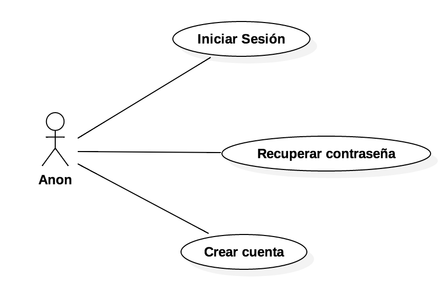

# Casos de uso

A continuación, se detallan todos los casos de uso del proyecto.

  

* **Iniciar sesión** El usuario puede iniciar sesión utilizando su correo electrónico y contraseña.

* **Registro** El usuario se registra proporcionando un correo electronico, contraseña y nombre. En caso de éxito se inicia sesión automaticamente.

* **Recuperar contraseña** El usuario puede recuperar su contraseña introduciendo su correo electrónico al que se le envía un mensaje para recuperar sus credenciales.
